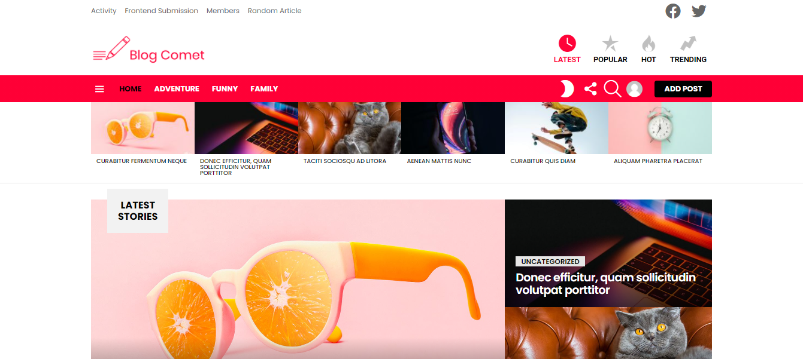

Blog comet is a blog website is a site that is updated with new information on an ongoing basis. It normally consists of a collection of posts. Posts may be short, informal, controversial, or more professional. There are a couple of things that set a blog apart from a traditional website. The first is that blogs are updated consistently.

## Table of contents
* [General info](#general-info)
* [Demo](#demo)
* [Screenshots](#screenshots)
* [Technologies](#technologies)
* [Setup](#setup)
* [Features](#features)
* [Status](#status)
* [Contact](#contact)
* [License](#license)

## General info

## Demo

## Screenshots

## Technologies
* Wordpress - version 5.6

## Setup

## Features

## Status
Project is: _finished_

## Contact
contact@delta-dev-software.com

## License
<a href="license.txt">MIT License</a>